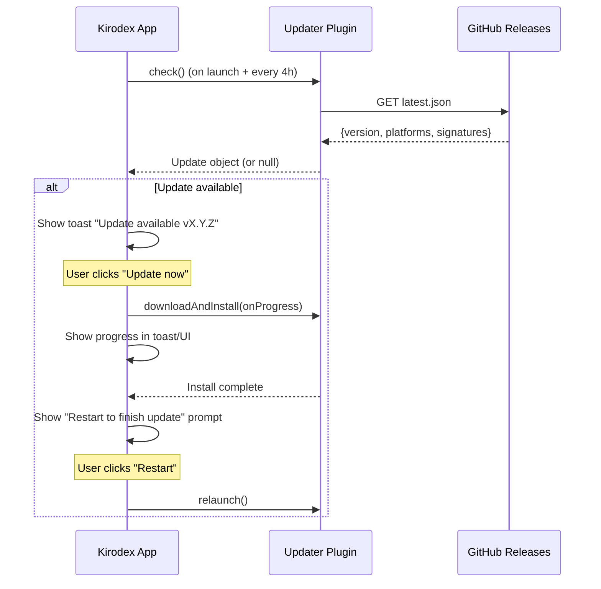

# Kirodex Auto-Update Implementation Plan

## Problem Statement

Kirodex has no in-app update mechanism. Users must manually download new releases from GitHub or run `brew upgrade`. We need to add automatic update checking and in-app installation using the Tauri v2 updater plugin, backed by GitHub Releases.

## Requirements

- Auto-check for updates on launch + every 4 hours while running
- Show a toast notification when an update is available with an "Update now" action
- Add a "Check for updates" button in Settings > General
- After downloading and installing, prompt the user to restart (don't force it)
- Use GitHub Releases as the update endpoint (static `latest.json`)
- Sign update artifacts with a Tauri signing keypair
- Homebrew users continue updating via `brew upgrade` (no conflict)

## Background

### Current State
- Release workflow: tag push → `tauri-action` builds macOS/Linux/Windows → uploads to GitHub Release → updates Homebrew cask
- macOS code signing/notarization already configured (Apple Developer ID certs)
- No updater plugin installed (Rust or JS)
- No `TAURI_SIGNING_PRIVATE_KEY` in CI secrets
- No `createUpdaterArtifacts` in `tauri.conf.json`
- No `updater:default` permission in capabilities

### Tauri v2 Updater Plugin
- Rust crate: `tauri-plugin-updater` — init in `lib.rs` via `Builder::new().build()`
- JS package: `@tauri-apps/plugin-updater` — `check()` returns update object, `downloadAndInstall()` with progress events
- Also needs `tauri-plugin-process` for `relaunch()`
- Requires signing keypair: public key in `tauri.conf.json`, private key as `TAURI_SIGNING_PRIVATE_KEY` env var at build time
- `createUpdaterArtifacts: true` in bundle config generates `.sig` files alongside bundles
- `tauri-action` auto-generates `latest.json` and uploads it to the GitHub Release
- Endpoint format: `https://github.com/thabti/kirodex/releases/latest/download/latest.json`
- Static JSON format:
  ```json
  {
    "version": "0.9.0",
    "notes": "Release notes",
    "pub_date": "2026-04-11T00:00:00Z",
    "platforms": {
      "darwin-aarch64": { "signature": "...", "url": "https://..." },
      "linux-x86_64": { "signature": "...", "url": "https://..." },
      "windows-x86_64": { "signature": "...", "url": "https://..." }
    }
  }
  ```
- Permissions needed: `updater:default` in capabilities
- macOS produces: `.app.tar.gz` + `.app.tar.gz.sig`
- Linux: `.AppImage` + `.AppImage.sig`
- Windows: `.exe` + `.exe.sig`, `.msi` + `.msi.sig`

## Proposed Solution



### Key Design Decisions
1. **GitHub Releases as endpoint** — No server to maintain. `tauri-action` generates `latest.json` automatically.
2. **Toast + Settings** — Non-intrusive toast on auto-check; manual check in Settings for users who want control.
3. **Prompt to restart** — Don't force restart; let the user finish their work.
4. **Single update hook** — One `useUpdateChecker` React hook handles auto-check interval, manual check, and state.

## Task Breakdown

### Task 1: Generate signing keypair and configure CI secrets

**Objective:** Create the Tauri updater signing keypair and store it in GitHub Actions secrets.

**Implementation:**
- Run `bunx tauri signer generate -w ~/.tauri/kirodex.key` locally to generate the keypair
- Copy the public key output (will go into `tauri.conf.json` in Task 2)
- Add two GitHub Actions secrets to `thabti/kirodex`:
  - `TAURI_SIGNING_PRIVATE_KEY` — contents of `~/.tauri/kirodex.key`
  - `TAURI_SIGNING_PRIVATE_KEY_PASSWORD` — the password used during generation (or empty)
- Back up the private key securely (losing it = can't push updates to existing installs)

**Demo:** Secrets visible in GitHub repo Settings > Secrets. Private key backed up.

---

### Task 2: Install updater + process plugins and configure Tauri

**Objective:** Add the Tauri updater and process plugins to the project and configure `tauri.conf.json`.

**Implementation:**
- Add Rust dependencies to `src-tauri/Cargo.toml`:
  ```toml
  tauri-plugin-updater = "2"
  tauri-plugin-process = "2"
  ```
- Add JS dependency:
  ```bash
  bun add @tauri-apps/plugin-updater @tauri-apps/plugin-process
  ```
- Initialize plugins in `src-tauri/src/lib.rs` inside `tauri::Builder`:
  ```rust
  .plugin(tauri_plugin_process::init())
  .setup(|app| {
      #[cfg(desktop)]
      app.handle().plugin(tauri_plugin_updater::Builder::new().build())?;
      // ... existing setup
  })
  ```
- Update `tauri.conf.json`:
  ```json
  {
    "bundle": {
      "createUpdaterArtifacts": true
    },
    "plugins": {
      "updater": {
        "pubkey": "<PUBLIC_KEY_FROM_TASK_1>",
        "endpoints": [
          "https://github.com/thabti/kirodex/releases/latest/download/latest.json"
        ]
      }
    }
  }
  ```
- Add permissions to `src-tauri/capabilities/default.json`:
  ```json
  "updater:default",
  "process:default"
  ```
- Verify `cargo check` passes

**Demo:** `cargo check` succeeds. Plugin initializes without errors on `bun run dev`.

---

### Task 3: Update release workflow to pass signing key and generate `latest.json`

**Objective:** Configure the CI workflow so `tauri-action` signs update artifacts and generates `latest.json`.

**Implementation:**
- Add env vars to the `tauri-action` step in `.github/workflows/release.yml`:
  ```yaml
  env:
    TAURI_SIGNING_PRIVATE_KEY: ${{ secrets.TAURI_SIGNING_PRIVATE_KEY }}
    TAURI_SIGNING_PRIVATE_KEY_PASSWORD: ${{ secrets.TAURI_SIGNING_PRIVATE_KEY_PASSWORD }}
  ```
- `tauri-action` automatically detects `createUpdaterArtifacts: true` and the signing key, then:
  - Generates `.sig` files for each bundle
  - Creates and uploads `latest.json` to the GitHub Release
- No other workflow changes needed — `tauri-action` handles the rest

**Test:** Do a test release (e.g., `v0.8.4-beta.1` prerelease tag) and verify:
- `.sig` files appear alongside bundles in the release assets
- `latest.json` is uploaded with correct platform entries
- Signatures in `latest.json` match the `.sig` file contents

**Demo:** GitHub Release contains `latest.json` with valid signatures for all platforms.

---

### Task 4: Build the `useUpdateChecker` hook

**Objective:** Create a React hook that checks for updates on launch, periodically, and on demand.

**Implementation:**
- Create `src/renderer/hooks/useUpdateChecker.ts`:
  ```typescript
  // State: idle | checking | available | downloading | ready | error
  // Exposes: checkNow(), downloadAndInstall(), restart(), progress, updateInfo, state
  ```
- On mount: call `check()` from `@tauri-apps/plugin-updater`
- Set up `setInterval` for 4-hour periodic checks
- `downloadAndInstall()` tracks progress via the event callback (`Started`, `Progress`, `Finished`)
- `restart()` calls `relaunch()` from `@tauri-apps/plugin-process`
- Store update state in a zustand store for cross-component access (Settings + App.tsx toast)
- Handle errors gracefully — network failures should not crash the app or spam the user

**Demo:** Hook logs update check results to console. `checkNow()` can be called from React DevTools.

---

### Task 5: Wire up toast notification for auto-check

**Objective:** Show a non-intrusive toast when an update is found, with download progress and restart prompt.

**Implementation:**
- In `App.tsx`, use the `useUpdateChecker` hook
- When state transitions to `available`: show a Sonner toast with:
  - "Kirodex vX.Y.Z available" + "Update now" button
- When user clicks "Update now": start `downloadAndInstall()`, update toast to show progress
- When state transitions to `ready`: update toast to "Update installed — Restart now?" with "Restart" button
- Clicking "Restart" calls `relaunch()`
- Toast should be dismissible — user can ignore and update later
- Don't show toast if no update available (silent success)
- Don't re-show toast for the same version if user dismissed it (store dismissed version in localStorage)

**Demo:** Launch app → toast appears if update available → click "Update now" → progress shown → "Restart" prompt appears.

---

### Task 6: Add "Check for updates" to Settings panel

**Objective:** Add a manual update check button in Settings > General.

**Implementation:**
- In `SettingsPanel.tsx`, add an "Updates" section in General:
  - "Check for updates" button
  - Inline status: checking spinner, "Up to date ✓", or "vX.Y.Z available — Update now"
- Wire to the same zustand update store from Task 4
- Button calls `checkNow()`
- If update available, show "Update now" button inline that triggers download + install flow
- After install completes, show "Restart to finish update" with restart button

**Demo:** Open Settings > General → click "Check for updates" → shows result → can trigger update from Settings.

---

### Task 7: End-to-end test with a prerelease

**Objective:** Validate the full update flow works across platforms.

**Implementation:**
- Temporarily set the app version to something old (e.g., `0.0.1`) in `tauri.conf.json`
- Build locally or push a test prerelease tag
- Ensure `latest.json` on GitHub has a newer version
- Launch the app → verify:
  - Auto-check fires on launch
  - Toast appears with correct version
  - "Update now" downloads with progress
  - "Restart" relaunches the app at the new version
- Test the Settings > "Check for updates" flow
- Test dismissing the toast (shouldn't re-appear for same version)
- Test with no network (should fail gracefully, no crash)
- Restore version numbers after testing

**Demo:** Full update lifecycle works: detect → download → install → restart → running new version.
