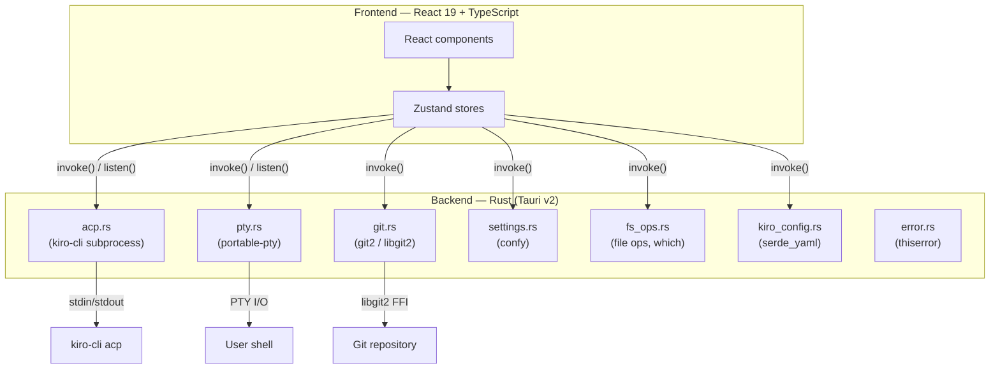
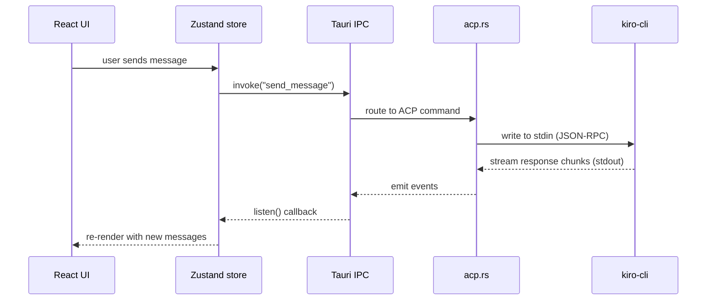

# Architecture

## System overview

## Data flow

## Backend modules

| Module | Purpose |
|--------|---------|
| `acp.rs` | Spawns `kiro-cli acp` as a subprocess, implements the ACP `Client` trait. Runs on a dedicated OS thread with a single-threaded tokio runtime (`!Send` futures). Communicates with Tauri via `mpsc` channels. |
| `git.rs` | Git operations via `git2` (libgit2). Branch, stage, commit, push, revert, diff. |
| `settings.rs` | Config persistence via `confy`. Handles XDG/macOS paths. |
| `fs_ops.rs` | File operations, kiro-cli detection via `which`, project file listing via git2 index. |
| `kiro_config.rs` | `.kiro/` config discovery. Parses agents, skills, steering rules, MCP servers. Frontmatter via `serde_yaml`. |
| `pty.rs` | Terminal emulation via `portable-pty`. |
| `error.rs` | Shared `AppError` type via `thiserror` with `From` impls for git2, IO, JSON, confy errors. |

## Tech stack

| Layer | Technology |
|-------|-----------|
| Desktop | Tauri v2 |
| Backend | Rust 2021, git2, thiserror, confy, serde_yaml, which |
| Frontend | React 19, TypeScript 5, Vite 6 |
| Styling | Tailwind CSS 4 |
| State | Zustand 5 |
| UI | Radix UI, Lucide icons |
| Code | Shiki (syntax highlighting) |
| Terminal | xterm.js + portable-pty |
| Diff | @pierre/diffs |
| Markdown | react-markdown + remark-gfm |

See [CONTRIBUTING.md](../CONTRIBUTING.md) for code style, project layout, and additional details.
